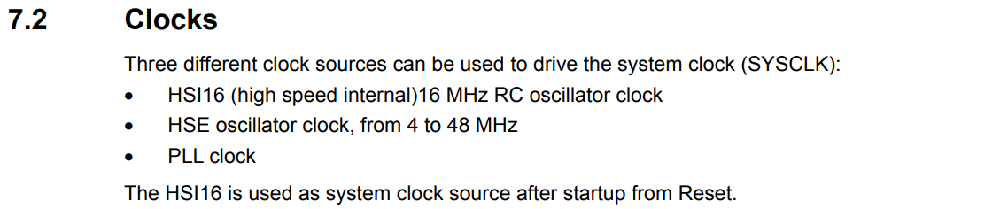

# Understanding Default Clocks and GPIO Clock Configuration on STM32G4xx

When working with the STM32G4xx series microcontrollers, understanding how the clock system operates is fundamental to writing efficient and reliable firmware.

## The Default Clock on Reset

The STM32G4xx series offers three different clock sources:

1. **HSI (High-Speed Internal clock)**
2. **HSE (High-Speed External clock)**
3. **PLL (Phase-Locked Loop)**

On reset, the system **defaults to the HSI** (typically an internal 16 MHz RC oscillator). This is important because unless reconfigured, this is the clock source your code starts running with. This detail is explicitly stated in the reference manual, though it may require careful reading of the "Reset and Clock Control (RCC)" section.

## Finding the GPIO Clock Configuration

Once the default clock is understood, the next step is configuring the clocks for peripherals—such as the GPIOs. Each peripheral requires its clock to be enabled before it can be used.

To enable a GPIO clock:

1. Open the **RCC** (Reset and Clock Control) chapter in the reference manual.
2. Locate the **AHB2ENR** register (Advanced High-performance Bus 2 Enable Register).
3. Set the corresponding GPIOxEN bit. For example, to enable GPIOA, set the **GPIOAEN** bit.

Without this step, any read or write to the GPIO registers will have no effect.

Refer to the RCC register mapping and GPIO section of the reference manual for a full list of GPIO port enable bits.
