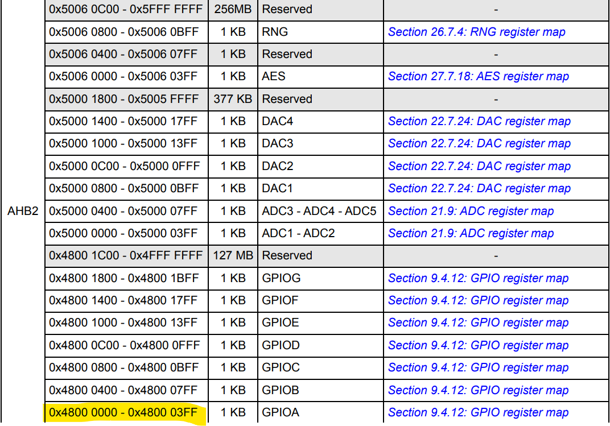
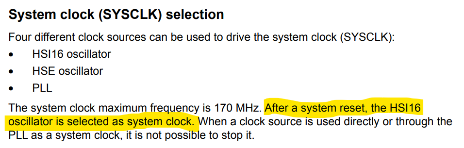

# 🧠 Introduction

The **STM32G4 series**, like most microcontrollers, provides access to GPIO ports through **memory-mapped registers**. One of the most valuable lessons I’ve learned through this project is how to navigate and interpret the **reference manual** and **datasheet** — both essential tools for bare-metal development.

Although I’ve worked with other microcontrollers before, this was my first experience using ST’s ecosystem at the bare metal level. I was curious to see how they structure their technical documentation, and just how steep the learning curve for doing a simple blinking LED would be.

---

## 💡 Why Bare-Metal?

Since this project is called **`baremetal-blink`**, my goal from the start was to work *without* relying on STM32CubeMX, HAL, or any abstraction layers. I wanted full control and a deeper understanding of how the microcontroller works at the register level.

---

## 🎯 What I Set Out to Do

My first task was to blink the onboard LED connected to **PA5** (Port A, Pin 5) on the Nucleo-G431RB board. Once that was working, I added **PA1** just to explore configuring another pin — even though it isn’t connected to anything on the board.

This decision helped me reason about:

- How to configure GPIO pins manually
- How to use **bit masking** to modify specific register fields
- How to verify pin behavior even without a visible output

---

## 📚 Understanding the Documentation

Initially, I dove into **Chapter 9** of the reference manual, which covers GPIO configuration. But I quickly hit a wall trying to figure out where register addresses actually came from. I had to take a look at the memory map.

- **Chapter 2: System and Memory Overview**

That was quick and easy and I could see here what they meany by address ofset for their GPIO Peripheral.

- **Chapter 7: Reset and clock control**

A question I had was, how did the microcontroller decide what clock it would use. Luckily for me, it was just stated in the reference manual, which begs the question.
Without any external help, how would I have found all of this out? I don't often think of an area of study as gatekept. But there is a small wall when you first start learning things that often require a teacher or external help.

---

## 🛠️ The Role of Bit Masking

Almost everything in this project boils down to manipulating bits:
- Setting two bits to select a mode
- Clearing bits before updating a field
- Toggling a specific bit with XOR

I relied heavily on shifting (`1 << N`), masking (`&= ~mask`), and setting (`|= mask`) techniques. It felt like building logic gates manually — which is exactly what makes bare-metal programming so satisfying.

---

In the code sections that follow, I’ve added comments to explain *where* each value came from, including references to the specific manual sections that informed each choice. It’s very much a **trial-and-error narrative**, and I hope it helps others understand the “why” behind the bit-level work.
